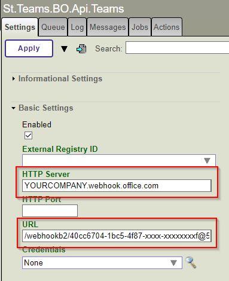
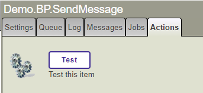
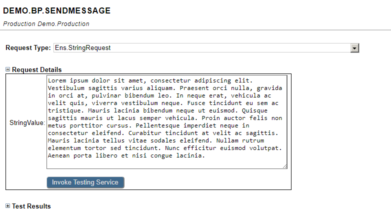
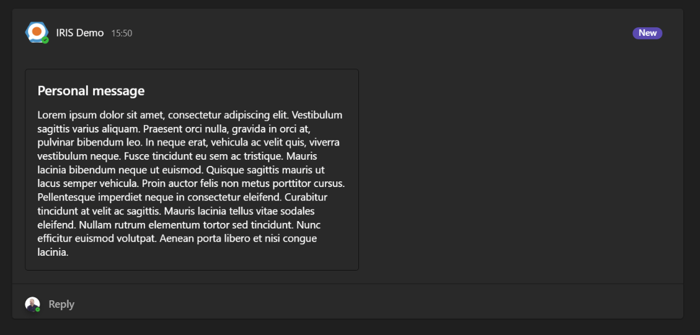
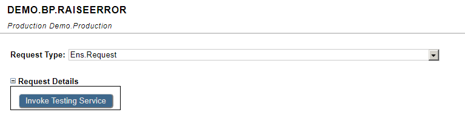
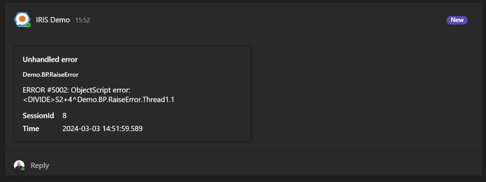

 [](LICENSE)
# iris-teams-adapter
This is a library to connect your message to Microsoft Teams.
Includes a data transformer to convert Ens.AlertRequest messages into a message structure that is captured by Teams via Webhook

## The idea
Due to a need on the part of my company's development team to be able to receive error messages from an IRIS production directly in an MS Teams group, we developed some components to be able to convert error alerts into messages that are captured by MS Teams via Webhook.

You can configure the Webhook in your MS Teams account by following the instructions on the "[How to create an incoming webhook](https://learn.microsoft.com/es-es/microsoftteams/platform/webhooks-and-connectors/how-to/add-incoming-webhook?tabs=newteams%2Cdotnet#create-an-incoming-webhook)" page

## Install ZPM
Use the command zpm "install iris-teams-adapter" to install direcly in your nanespace

## Prerequisites
Make sure you have [git](https://git-scm.com/book/en/v2/Getting-Started-Installing-Git) and [Docker desktop](https://www.docker.com/products/docker-desktop) installed.

## Installation

- Clone/git pull the repo into any local directory

```powershell
git clone https://github.com/KurroLopez/iris-teams-adapter .\iris-teams-adapter
```

- Open the terminal in this directory and run:

```
$ docker-compose build
```

- Run the IRIS container with your project:

```
$ docker-compose up -d
```

## Demo
Open the production [http://localhost:52773/csp/user/EnsPortal.ProductionConfig.zen](http://localhost:52773/csp/user/EnsPortal.ProductionConfig.zen)
```
User: superuser
Pass: SYS
Namespace: USER
```

Configure your Webhook in St.Teams.BO.Api.Teams
```
Webhook link: https://YOURCOMPANY.webhook.office.com/webhookb2/40cc6704-1bc5-4f87-xxxx-xxxxxxxxf@5xxxxxa-643b-47a3-xxxxx-fc962cc7cdb2/IncomingWebhook/6f272d796f1844b8b0b57b61365f8961/2ff46079-ee4a-442b-a642-dc418f6c67ee
**Server:** YOURCOMPANY.webhook.office.com
**URL:** /webhookb2/40cc6704-1bc5-4f87-xxxx-xxxxxxxxf@5xxxxxa-643b-47a3-xxxxx-fc962cc7cdb2/IncomingWebhook/6f272d796f1844b8b0b57b61365f8961/2ff46079-ee4a-442b-a642-dc418f6c67ee
```



If you want to test, using the BPs in the demo production, select "Test" button and invoke testing service




Check in your teams group



For test RaiseError, select any Ens.Request, it doesn't need any entry.



